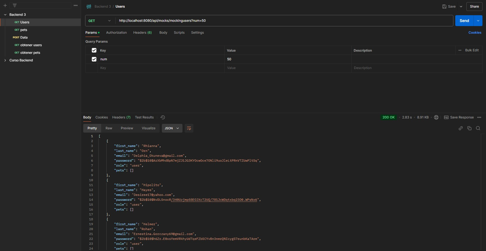
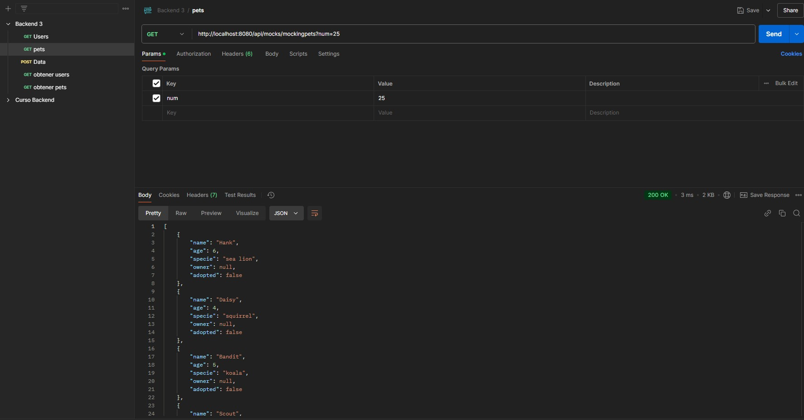
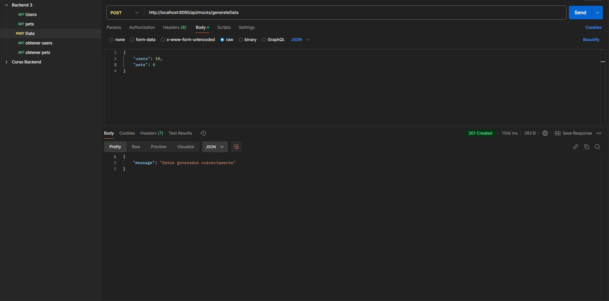
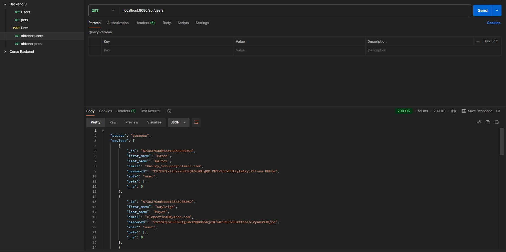
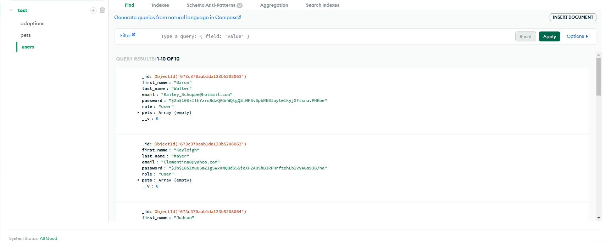
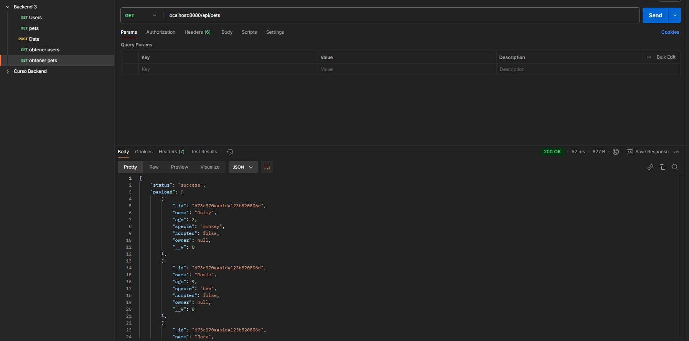
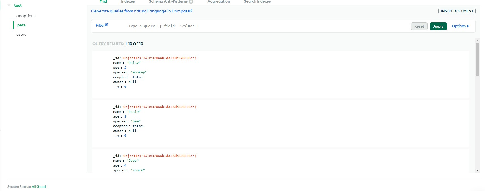
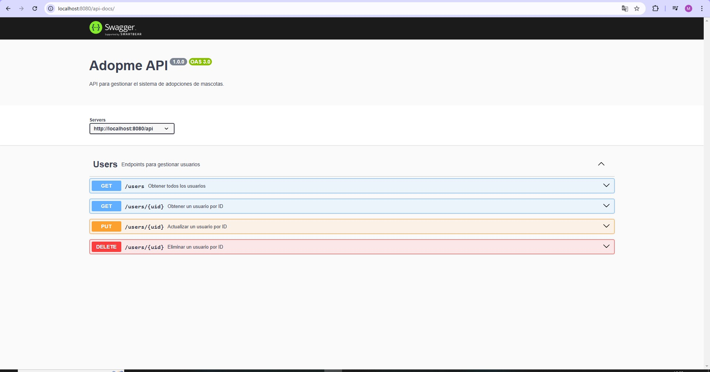

# PRIMERA PRE ENTREGA - BACKEND 3

## Imagen DockerHUB
- URL imágen Docker: https://hub.docker.com/r/maxicuello/backend3_entrega
    * Clonar imágen: 
    ```bash 
    docker pull maxicuello/backend3_entrega
    ```

## REQUISITOS

- MongoDB
- NODE.JS v14 o superior

## Instalación del proyecto

Paso 1
* Clonar repositorio o descargar los archivos.

```bash
git clone https://github.com/GMaximilianoCuello/Backend3-Entrega
```
Paso 2
* instalar dependencias.

```bash
npm install
```
Paso 3 Configurar las variables
* Las variables de entornos las encontraras en el archivo **.env.examble**.

Paso 4 
* Ejecuta el proyecto.

```bash
npm start
```

## FUNCIONES

* Metodo GET para generar usuarios/users (Tener en cuenta los params de postman)

GET - http://localhost:8080/api/mocks/mockingusers?num=50



* Metodo GET para generar mascotas/pets (Tener en cuenta los params de postman)

GET - http://localhost:8080/api/mocks/mockingpets?num=25



* Metodo POST para insertar los datos generados en la base de datos
    * En Postman, nos dirigimos a body y seleccionamos RAW con formato JSON:
    {
        "users": 10,
        "pets": 5
    }

POST - http://localhost:8080/api/mocks/generateData



### Comprobar base de datos

Users:



* USERS EN MONGO


Pets:


* PETS EN MONGO


## SWAGGER
### Para ver la documentación de los endpoints `users`, abrir en el navegador: 

```bash
http://localhost:8080/api-docs
```


## TESTING
### Tests funcionales

1. ejecuta los test
```bash
npm test
```
2. Pruebas inlcuidas
    * **Router `adoption.test.js`** 
        - GET `/api/mocks/mockingusers`
        - GET `/api/mocks/mockingusers?num=${num}`
        - GET `/api/mocks/mockingpets`
        - GET `/api/mocks/mockingpets?num=${num}`
        - GET `/api/mocks/generateData`